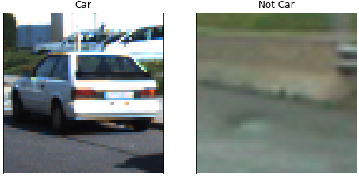
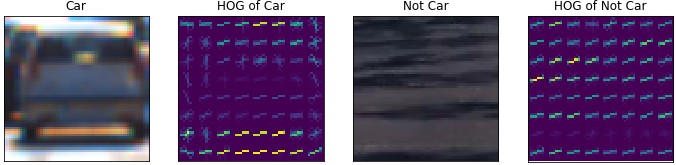
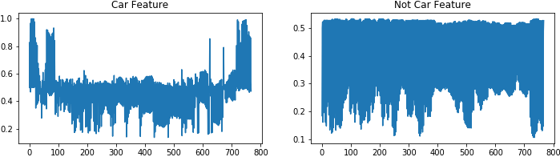
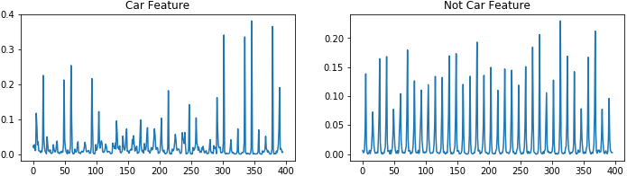
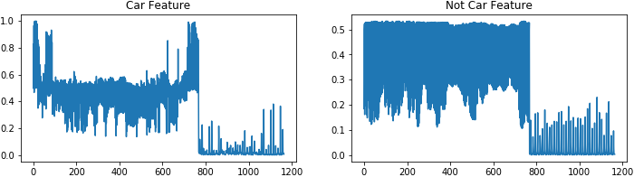
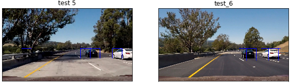
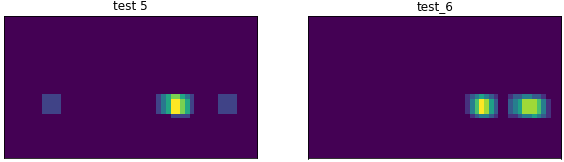
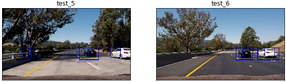

##Writeup Template

**Vehicle Detection Project (P5)**

The goals / steps of this project are the following:

* Perform a Histogram of Oriented Gradients (HOG) feature extraction on a labeled training set of images and train a classifier Linear SVM classifier
* Optionally, you can also apply a colour transform and append binned colour features, as well as histograms of colour, to your HOG feature vector. 
* Note: for those first two steps don't forget to normalize your features and randomize a selection for training and testing.
* Implement a sliding-window technique and use your trained classifier to search for vehicles in images.
* Run your pipeline on a video stream (start with the test_video.mp4 and later implement on full project_video.mp4) and create a heat map of recurring detections frame by frame to reject outliers and follow detected vehicles.
* Estimate a bounding box for vehicles detected.

[//]: # (Image References)
[image1]: ./output_images/car_vs_notcar.png
[image2]: ./examples/HOG_example.jpg
[image3]: ./examples/sliding_windows.jpg
[image4]: ./examples/sliding_window.jpg
[image5]: ./examples/bboxes_and_heat.png
[image6]: ./examples/labels_map.png
[image7]: ./examples/output_bboxes.png
[video1]: ./project_video.mp4

### Writeup approach
Here I will consider the [Rubric](https://review.udacity.com/#!/rubrics/513/view) points individually and describe how I addressed each point in my implementation.  

---
###Writeup

#####1. Provide a Writeup / README that includes all the rubric points and how you addressed each one.  
Below I have discussed the implemented vehicle detection pipeline and its key steps.

### Feature Extraction

#####1. Explain how (and identify where in your code) you extracted HOG features from the training images.

First, I have imported the file-paths in Notebook as seen in Box #2, and verified whether I am reading the images properly or not (Box #3).  I could see both car image and 'notcar' images.  This suggest me I have got the right images to start working on.  Here is an example output from both class of images (car and notcar):

 

Next, I have defined methods to extract feature vectors that were introduced in the classroom materials. This includes Histogram of Oriented Gradients (HOG), spatial information, and colour histogram information.  In addition, by combining those features, I have defined the 'total' feature vector.  The basic feature extraction methods as well as 'feature combining function' are coded in Box #4.  The 'single_img_feature()' method essentially return the total feature vector depending on the selection of basic features (i.e., HOG, spatial, or colour).  The 'extract_feature' method basically repeats the process for an array of images.

The plot below shows the difference of HOG image for a car and a non-car.  Clearly, HOG image captures the profile of the object, and can help classifier to generalize car feature.

 

In order to find a good combination of features to define total feature vector, I have visualized results of each feature as well as result of combination.  Below I have presented example images that show how total feature is generated by stacking individual features. In this example, I am using the `YCrCb` colour space and an stacked version of spatial and HOG feature:

 

1. Example of Spatial Feature vector (`spatial_size=(32,32)`)

 

2. Example of HOG Feature vector (HOG parameters of `orientations=9`, `pixels_per_cell=(8, 8)` and `cells_per_block=(2, 2)`)

 

3. Example of a total Feature vector (HOG + Spatial)

#####2. Explain how you settled on your final choice of HOG parameters.

I have tried combinations various colour spaces and found both YCrCb and YUV produces good for all HOG channels.  However, I have chosen YCrCb over YUV. I have found combination of all three features produces best result during classifier training. The spatial size, histogram bin size, and orientation bin size that best worked for me was (32x32), 32, and 9 respectively, creating a nice balance between performance and accuracy.  The hyper-parameters that I have found after tuning are below:

* colour_space = 'YCrCb'
* spatial_size=(32,32)
* hist_bins=32 
* orient = 9
* pix_per_cell = 8
* cell_per_block = 2
* hog_channel = 'ALL'

#####3. Describe how (and identify where in your code) you trained a classifier using your selected HOG features (and colour features if you used them).

I have trained a linear Support Vector Machine (SVM) to classify between cars and notcar images. The normalized and scaled features for both labelled cars and notcars images were provided to the classifier. Using combination of all three features, the SVM resulted in:

* Test accuracy = 98.99%
* Time to train = 22.88 sec
* Length of feature vector = 8460

###Sliding Window Search

#####1. Describe how (and identify where in your code) you implemented a sliding window search.  How did you decide what scales to search and how much to overlap windows?

Since cars in an image of a road will most likely stay at lower half of the image; therefore, I have restricted my search to `y_start_stop = [400, 600]`. I have used scale factor of 1.5 to generate multi-scale windows and to slide the windows I have used a shift of 2 cells at each step.  This has allowed me to complete an image search with 196 windows as seen in the results of Box #, and took less than half a second to process one image.

My searching pipeline is: 

1. Generates multi-scale windows within the restricted y-axis of the image. 
2. Slide window through the image while respecting cells_per_step boundary. 
3. Inspects every window to extract feature
4. Extracts features in the window to evaluate its class
5. classify the image in window as either car/notcar and accepts it accordingly
6. Generates heatmap of the windows that is detected as a car
7. Bounds box around the heatmap region
8. Finally filters false positive based on number of heatmaps. (used in video implementation)

#####2. Show some examples of test images to demonstrate how your pipeline is working.  What did you do to optimize the performance of your classifier?

The searching window pipeline was optimized primarily by restricting the search within a section of the image.  In addition to that, by choosing two cells to skip during sliding has reduced image processing time.  Basically, the sliding continues in y direction by shifting two cells until one row in y-direction is completed and then shifted two cells in x-direction search.  And again, search continue in the y direction until that column is completed.  And by doing this until entire region of image, we are able to test the entire frame for a possible car detection. Below are examples of sliding window search results. 

 

Then heatmap was drawn based on the rectangle formed by the positive window:

 

Finally location of the heatmap blobs were found using from 'scipy.ndimage.measurements.label' function, and then a bounding box is drawn around the label to get a cleaned up rectangle around the detected car. 

 

However, there were still noise/false positives found which was taken care in the next stage with some filtering.

### Video Implementation

#####1. Provide a link to your final video output.  Your pipeline should perform reasonably well on the entire project video (somewhat wobbly or unstable bounding boxes are ok as long as you are identifying the vehicles most of the time with minimal false positives.)

Here's the [link to my video result](./project_video_processed.mp4).  In order to filter the false positive heatmaps, I have used a simple "confidence estimation" type filter, which produced good result.  Next section briefly discusses the filtering strategy.

#####2. Describe how (and identify where in your code) you implemented some kind of filter for false positives and some method for combining overlapping bounding boxes.
Basically, I have defined a 'HeatmapsBuffer' class in Box #11, that keeps record of last 25 frames of detected cars/heatmaps (both good and bad).  While looking at last 25 frame I see the total number of heatmaps in that 25 frame.  If its more than 15 or 60% of the buffer, I qualify that as a good/filtered heatmap.  Accordingly, in the next step the blob is found and bounding box is created on that filtered heatmap.

The performance of the filter was good, and the video can be seen in the same aforementioned [link](./project_video_processed.mp4).

###Discussion

####1. Briefly discuss any problems / issues you faced in your implementation of this project.  Where will your pipeline likely fail?  What could you do to make it more robust?

* Prior to the filter implementation I could see relatively high number of false positives.  I would love to reduce false positive before the filtering stage.  For which I need to make the classifier robust enough in detecting cars.  I want to focus more on the feature extraction size to try out features that can support that complements classifier performance, particularly for images in various lighting condition. 
* I also want to try other classifier (e.g., using deep-learning networks), data augmentation in my future work, as well as look into window-search optimization techniques to reduce processing time.